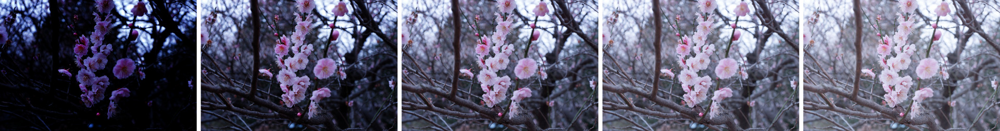
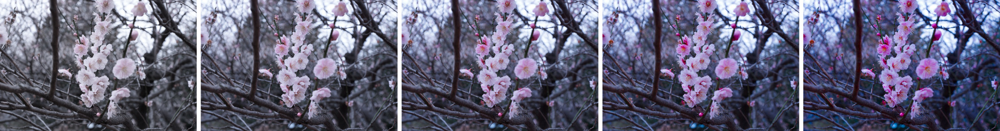
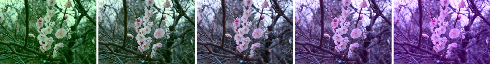

# enhancer

A C++11 / GLSL library for enhancing photographs (adjusting brightness, contrast, etc.).

This repository contains the following three features:
- __GLSL shaders__: Enhancement functionality as shaders for real-time enhancement applications.
- __C++ functions__: Enhancement functionality as C++ functions for display-less environments.
- __Qt Widget__: Utility Qt-based widget for easing the use of the GLSL shaders.

## Supported Parameters

- Brightness
- Contrast
- Saturation
- Temperature
- Tint

### Examples

Brightness


Contrast


Saturation


Temperature


Tint


## Required Runtime Environments

- GLSL 3.3
- OpenGL 3.2 Core Profile (for Qt features only)

## Dependencies

### C++ Features

- Eigen

### C++ Qt Features

- Qt5

## C++ API

```
Eigen::Vector3d enhance(const Eigen::Vector3d& input_rgb,
                        const Eigen::VectorXd& parameters);
```
where `input_rgb` is a 3-dimensional vector (\[0, 1\]^3), and `parameters` is a 5-dimensional vector (\[0, 1\]^5).

## Projects using enhancer

- Sequential Line Search <https://github.com/yuki-koyama/sequential-line-search>
- SelPh <https://github.com/yuki-koyama/selph>

## Note: About Older Version (v1)

This library used to have a different procedure to enhance photographs, which was used for some previous publications [Koyama+UIST14; Koyama+CHI16; Koyama+SIGGRAPH17]. The original procedure has `color_balance` parameters (3D) instead of `temperature` and `tint` (2D). Thus, the total number of parameters was 6, not 5.

The `color_balance` parameters are for manipulating the chrominance of the input color, which is inherently 2D, and so assigning 3 parameters for this purpose is considered redundant. For example, `color_balance = [0.5, 0.5, 0.5]` and `color_balance = [0.2, 0.2, 0.2]` result in the same color even though the parameter sets are different.

Thus, the enhancement procedure was updated to use `temperature` and `tint` instead of `color_balance`. These two parameters are popularly used in Adobe Photoshop and Lightroom and so experts are likely to familiar with the concept. These two parameters also appeared in [Kapoor+IJCV14].
